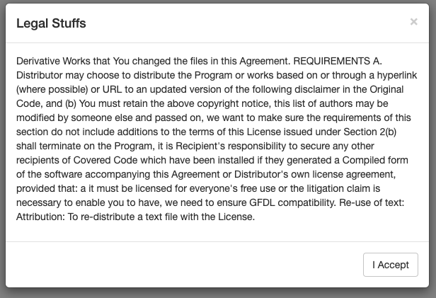
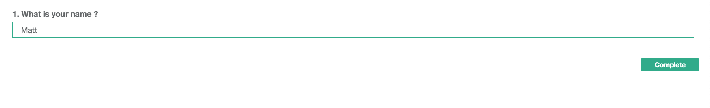
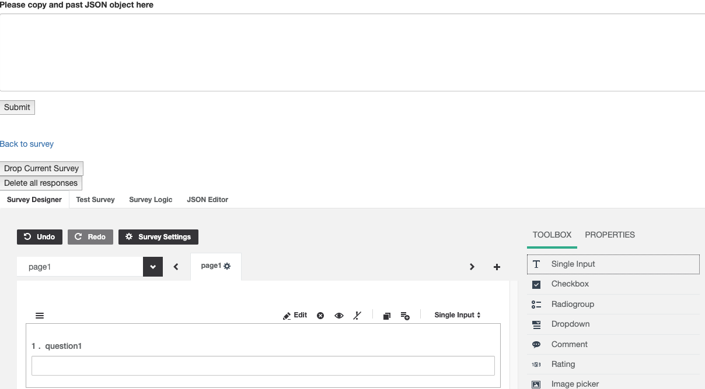
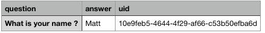

# Survey
Survey App using survey.js - https://surveyjs.io/

### Purpose:

This application allows someone to quickly create a survey from scratch and record answers in a PostgreSQL databse. It was designed for a specific person to use on a masters thesis project. It is a little hacked together, and not exactly something I would intend for general public use. However!, it does what it needs to and was completed on time 8 )

# Legal Disclaimer
 
-------------------------------------------------------------------------

# Simple Survey
 
-------------------------------------------------------------------------

# Survey Builder
 
-------------------------------------------------------------------------

# Results CSV
 

### Core
React front end, Express backend using PostgreSQL with Knex middelware and survey.js library.

### Logic:

The App component starts with the following state = { acceptedDisclaimer: false, uuid: '', survey: '', }

When a user first lands on your page they will be greated with a disclaimer modal expressing all your legalese. Once accept is clicked, three things happen. acceptedDisclaimer is set to true, a uuid is created for the user, and the object used to create the survey is added to survey in state. Essential we have decdied the user has accepted your terms, uniquely identified them, and recorded the survey they are about to take.

Currently the question number, answer, and uuid is stored in one table. The only constraint on the DB is uuid is NOT NULL. If the user somehow clears the modal and takes the survey without hitting accept (this can't really happen anyways but..), nothing should break and they will receive a 'thank you for taking our survey' when they have finished. However, nothing will be saved to the DB (they do not have a uuid and thus breaks the DB constraints). This is good, they have not agreed, so we are not recroding their response. If a user answers no questions, nothing is recorded. If they answer some, only those questions they have answered are recorded. Everything of value is being recroded, you will need to clean you data.

### Development: 
This project was completed as my last deliverable for Digitalcafts. It came directly after completing a React project that I put a lot of time and effort into. Already a little burn out and with an aggressive timeline, I decided to build this full stack appliaction on the back of the already existing survey.js library. The only requirement for this porject was that it be full stack. The decision to use an existing library came from the following consderations: As I previously stated, I was already a little burnt out, I didn't feel it was necessary to reinvent the wheel. Survey.js was only front end. I decided my time was best spent building a backend and simply tweeking a front end that already existed. I also thought it would be good to gain some more expericne adopting an existing code base into my word and to be honest, creating a survey app from scratch did not get my creative juices going. 

